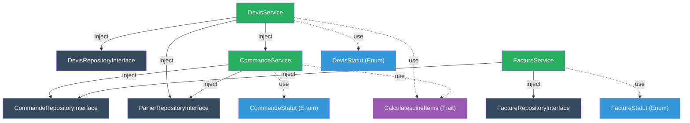

# ✅ Analyse & Refactorisation — Services Sales

## Résumé des Améliorations

> [!IMPORTANT]
> **12 fichiers modifiés/créés** — Toutes les routes compilent, les enums fonctionnent, les controllers sont compatibles.

---

## Fichiers Créés

| Fichier | Rôle |
|---------|------|
| [DevisStatut.php](file:///d:/asa/LesCasaniers/Les-casaniers-backend/app/Enums/Sales/DevisStatut.php) | Enum des statuts devis + machine à états |
| [CommandeStatut.php](file:///d:/asa/LesCasaniers/Les-casaniers-backend/app/Enums/Sales/CommandeStatut.php) | Enum des statuts commande + machine à états |
| [FactureStatut.php](file:///d:/asa/LesCasaniers/Les-casaniers-backend/app/Enums/Sales/FactureStatut.php) | Enum des statuts facture + machine à états |
| [CalculatesLineItems.php](file:///d:/asa/LesCasaniers/Les-casaniers-backend/app/Traits/CalculatesLineItems.php) | Trait de calcul `prix_unitaire × quantite` mutualisé |

## Fichiers Modifiés

| Fichier | Modifications |
|---------|---------------|
| [DevisService.php](file:///d:/asa/LesCasaniers/Les-casaniers-backend/app/Services/Sales/DevisService.php) | Refonte complète |
| [CommandeService.php](file:///d:/asa/LesCasaniers/Les-casaniers-backend/app/Services/Sales/CommandeService.php) | Refonte complète |
| [FactureService.php](file:///d:/asa/LesCasaniers/Les-casaniers-backend/app/Services/Sales/FactureService.php) | Refonte complète |
| [Devis.php](file:///d:/asa/LesCasaniers/Les-casaniers-backend/app/Models/Devis.php) | Cast enum + relation `commandes()` |
| [Commande.php](file:///d:/asa/LesCasaniers/Les-casaniers-backend/app/Models/Commande.php) | Cast enum + casts décimaux |
| [Facture.php](file:///d:/asa/LesCasaniers/Les-casaniers-backend/app/Models/Facture.php) | Cast enum |
| [PanierRepositoryInterface.php](file:///d:/asa/LesCasaniers/Les-casaniers-backend/app/Repositories/Paniers/PanierRepositoryInterface.php) | +3 méthodes |
| [PanierRepository.php](file:///d:/asa/LesCasaniers/Les-casaniers-backend/app/Repositories/Paniers/PanierRepository.php) | +3 implémentations |
| [CommandeRepositoryInterface.php](file:///d:/asa/LesCasaniers/Les-casaniers-backend/app/Repositories/Sales/CommandeRepositoryInterface.php) | +1 méthode |
| [CommandeRepository.php](file:///d:/asa/LesCasaniers/Les-casaniers-backend/app/Repositories/Sales/CommandeRepository.php) | +1 implémentation |
| [FactureController.php](file:///d:/asa/LesCasaniers/Les-casaniers-backend/app/Http/Controllers/Api/Sales/FactureController.php) | Adaptation noms de méthodes |

---

## Problèmes Corrigés

### 1. ✅ Chaînes magiques → Backed Enums PHP 8.1

````carousel
```php
// ❌ AVANT — Risque de faute de frappe silencieuse
$allowed = [
    'brouillon' => ['envoye', 'expire'],
    'envoye' => ['accepte', 'refuse', 'expire'],
];
if (!in_array($status, $allowed[$devis->statut] ?? [])) { ... }
```
<!-- slide -->
```php
// ✅ APRÈS — Typage fort, autocomplétion IDE, refactoring sûr
// Chaque enum porte sa machine à états
public function transitionsAutorisees(): array {
    return match ($this) {
        self::Brouillon => [self::Envoye, self::Expire],
        self::Envoye    => [self::Accepte, self::Refuse, self::Expire],
        // ...
    };
}

// Dans le service :
if (!$devis->statut->peutTransitionVers($cible)) { ... }
```
````

### 2. ✅ Violation Repository Pattern → Injection correcte

````carousel
```php
// ❌ AVANT — Accès direct au Model Panier dans CommandeService
$itemsPanier = Panier::where('utilisateur_id', $userId)
    ->where('statut', 'actif')
    ->with('produit')
    ->get();

Panier::where('utilisateur_id', $userId)
    ->where('statut', 'actif')
    ->update(['statut' => 'commande']);
```
<!-- slide -->
```php
// ✅ APRÈS — Via PanierRepositoryInterface injecté
$itemsPanier = $this->panierRepository->getActiveItemsWithProduit($userId);

$this->panierRepository->markActiveAsCommande($userId);
```
````

### 3. ✅ Transactions DB manquantes

| Opération | Avant | Après |
|-----------|:---:|:---:|
| `DevisService::accept()` | ❌ | ✅ `DB::transaction` |
| `CommandeService::createFromPanier()` | ❌ | ✅ `DB::transaction` |
| `FactureService::createFromCommande()` | ✅ | ✅ |

### 4. ✅ Nommage cohérent entre services

| Opération | DevisService | CommandeService | FactureService |
|-----------|:---:|:---:|:---:|
| Liste user | `index()` | `index()` | `index()` ✅ |
| Liste admin | `adminIndex()` | `adminIndex()` | `adminIndex()` |
| Détail user | `show()` | `show()` | `show()` ✅ |
| Détail admin | `adminShow()` ✅ | `adminShow()` | `adminShow()` |

### 5. ✅ Duplication calcul → Trait partagé

```php
// Trait CalculatesLineItems — utilisé par DevisService & CommandeService
protected function calculerSousTotal(Collection|array $items): float
protected function calculerLigne(object $item): float
```

### 6. ✅ Return types complets

Toutes les méthodes publiques des 3 services ont désormais des return types explicites (`Devis`, `Facture`, `Collection`, `array`, `bool`, `string`).

---

## Architecture Finale



---

## Corrections métier notables

> [!NOTE]
> - **CommandeStatut** : supprimé la transition `en_attente → remboursee` (logiquement, on ne rembourse pas une commande non payée)
> - **FactureStatut** : ajouté la transition `brouillon → annulee` (permettre l'annulation avant émission)
> - **DevisService::accept()** : désormais atomique via `DB::transaction` — si la commande échoue, le devis ne passe pas en `accepte`
> - Messages d'erreur enrichis : affichent maintenant la transition refusée (`en_attente → remboursee`) pour faciliter le debugging
